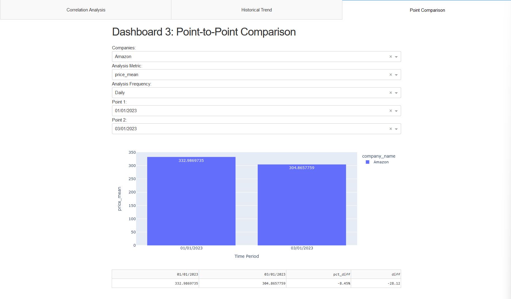

# Take Home Project - QR Tool
Data pipeline and dashboard for QR analytics purposes.

For a quick start, put raw csv files in `data/01_raw` and run `make run` at root.

**If you downloaded the codes as zip to run locally instead of cloning the git repo, remember to run `git init` to prevent pre-commit installation error**

---

## Table of Contents

- [Take Home Project - QR Tool](#take-home-project---qr-tool)
  - [Table of Contents](#table-of-contents)
  - [Usage](#usage)
    - [1. Backend](#1-backend)
    - [2. Dashboard](#2-dashboard)
    - [3. Examples, using Questions from Project Prompt](#3-examples-using-questions-from-project-prompt)
  - [Development Timeline](#development-timeline)
  - [Design Decisions](#design-decisions)
    - [1. Toolings](#1-toolings)
      - [I. Poetry](#i-poetry)
      - [II. Makefile](#ii-makefile)
    - [2. Structure](#2-structure)
      - [I. Project and Pipeline Structure](#i-project-and-pipeline-structure)
      - [II. Dashboard Structure](#ii-dashboard-structure)
      - [III. Data Models](#iii-data-models)
    - [3. Misc](#3-misc)
  - [Resources Used](#resources-used)
    - [I. Project Level](#i-project-level)
    - [II. Data Pipeline](#ii-data-pipeline)
    - [III. Dashboard](#iii-dashboard)
  - [Points of Improvements](#points-of-improvements)

---

## Usage
### 1. Backend
At the root of this project a `Makefile` is provided to make the usage easier. If you are running on Windows-based OS, [following this guide](https://stackoverflow.com/questions/32127524/how-to-install-and-use-make-in-windows) to properly install `make`.

1. To begin with, **make sure the raw data is in `data/01_raw` and make sure the root directory is git initialized**.
2. After the data is in place, simply type `make`, which is equivalent to running `make all`. This will creates a virtual environment for further uses. By default it will run the dev environment version. To run only the prod version, you can add environment arguments by running `make ENV=prod`. This will only install dependencies relevant to support the data pipeline and QR dashboards.

3. After the environment is created, if you are running this app for the first time, do `make run`, which executes the data pipeline and spins up the developed dashboard using `dash`. After the data is created, to just spin up the dashboard, run `make run-dashboard` instead, which will not re-run the pipeline again.

4. For developers, you can also run `make lint` to lint your codes, and `make test` to run all unit tests in `tests` directory via `pytest`.
5. Finally, for cleanup, run `make clean` to remove generated venv, cached files, and reports.

**So in summary, do `make run` for a quick start and `make clean` to cleanup.**

### 2. Dashboard
Dashboards are developed using `dash` and are hosted locally. By default it will be running on [http://127.0.0.1:8050/](http://127.0.0.1:8050/). However, this might be different from machine to machine depending on port usage. Check your terminal for the most accurate address.

**Tab 1** is the correlation plot, where self-correlation is removed (None) to better showcase the relative correlations of other pairs of metrics. Select the company name, analysis start date, and analysis end data. The dashboard will be refreshed to filter down to the selected data and showcase the correlations of existing metrics. The corresponding dataframe is also displayed down below.

**Tab 2** is a simple historical trend line plot that can support multi-company trend comparison. Select companies, analysis metric, frequence (e.g., quarterly), start, and end date.

**Tab 3** is a point-to-point comparison plot that can support historical data comparison. The two data points are displayed as bar charts, and the point difference, as well as the percentage difference (i.e., growth rate), are displayed as table below.

### 3. Examples, using Questions from Project Prompt
**Q1.**	What is the historical correlation between the price and CreditCardSpend for AMZN?

**A1.** Using the first correlation dashboard, it by default shows the historical correlation between metrics for Amazon. From the plot you can see that the correlation between price and creditcard spend is around `0.022`


**Q2.**	What is the YTD return of AMZN?

**A2.**This can be answered using the third point comparison dashboard. Select Amazon as company, day as frequency, price_mean as metric (since daily mean is the same as daily price here), point 1 being the beginning of the year, and point 2 being the latest point available. The return is the value difference, which is roughly `-28.12`



**Q3.**	What is the quarterly number of WebsiteVisits for AMZN?

**A3.**This can be solved by using the historical trend plot. Select Amazon as company, website_visits_sum as metric, and leave time history as is (full history).


**Q4.**	What is the year-over-year percentage change of quarterly WebsiteVisits for AMZN from Q4 2022 vs Q4 2021?

**A4.** Similar to Q2, this can be answered using the third comparison dashboard. Select Amazon as company, website_visits_sum as metric, quarterly as frequency, and select 2022 Q4 and 2021 Q4 as two data points. As seen in the table below, the growth rate is about `0.69%`


---

## Development Timeline
**Total time used: ~4 hours, excluding time to complete this README**

**Timeline**
- First 15 minutes are used to read through the prompt, draft up rough design of dashboard, draft up data models for dashboards, time allocation (2 hours 30 minutes for data pipeline, 1 hour for dashboard, and 20 minutes to generate unit tests and docstrings) and initialize project using `poetry` and past-project config files. See [project level resources used](#i-project-level) section for more details.
- The next 2 hours 30 minutes are used to develop data pipeline. Activities include initial data preview (simple EDA), discovered deprecated data as indicated in the project prompt, briefly structure pipeline layers, and code development.
- The following 1 hour is used to generate dashboard skeleton structure, populate div components, incorporate external CSS sheet, and develop callback logic within the skeleton outline.
- The final 20 minutes are used to generate function-level docstring and unit tests.

---

## Design Decisions
The overall summary of design decisions would be: **using past experience and artifacts to jump-start code development and simulate situations as if this is a day-to-day task.**

### 1. Toolings

#### I. Poetry
`poetry` is not required to run this project. However, it's ability to maintain project configurations and dependencies definitely helps to extend and generalize this app to different platforms, as seen in requirement files (where platform is specified for packages). With CI/CD added, poetry can play a important role to test out project compatibility with different python runtimes and OS platforms.

#### II. Makefile
`Makefile` is not standard for python projects, but I do personally find it helpful to simplify the usage. This specific script was something I wrote a while ago and moved over to this project for quicker jump start.

### 2. Structure
#### I. Project and Pipeline Structure
The project structure is fairly standard: src for source code, data to store data, and tests to store unit/integration tests for the app.

The design of the pipeline layers comes from past DE experience. Data can be catagorized into different stages along its lifecycle. Specifically, the flow goes as

```
raw -> intermediate -> primary -> feature -> model_input -> modeling -> model_output -> reporting
```

Given this is a small POC with no DS components, some layers are skipped to make the structure lean. For more details of each layer, you can check the script-level documentation in python scipts in `src`.

Given that the pipeline is structured as such, the corresponding unit tests are also structured in the same way to mirror the sub-pipeline that it relates to.

#### II. Dashboard Structure
From the given prompt, there are three main needs that this app should help solve: correlation, historical statistics/trend, and historical data comparison. Hence the three dashboards.

#### III. Data Models
First an foremost, data transformation should be light on the reporting side. Per past experience, heavy data transformations at the reporting end can cause significant runtime performance issues. Therefore, it's better to create the data to filter one rather than staging data to apply further transformation with.

Given so and combined with the above dashboard design, there need to be at least three different main datasets to support those three dashboards. However, you can see that correlation is a special case of data transformation. The latter two, however, share a similar need of data.

Therefore, two data models are needed for reporting purposes:
- one master dataframe with all available generic metrics in the same dataset for correlation calculation, which means combining consumer, price, and web activities using sec_master data
- one time-series aggregation of the master dataframe with different frequence intervals (e.g, yearly). Dashboard 2 and 3 can share this dataset by applying different filtering for their own needs.

### 3. Misc
- Having two requirement files can help separate the necessary toolings for developing this app vs. using this app. It helps to offload the size of the project on the user end by removing unnecessary packages that are not necessarily needed for just using the dashboard.
- `setup.cfg` is only added because `flake8` doesn't work with `pyproject.toml` :(
---

## Resources Used
### I. Project Level
- The project is created using `poetry`, which maintains `pyproject.toml` and dependencies (`requirements.txt` and `requirements-dev.txt`).
- Tooling configurations within `pyproject.toml` (such as Black) and `setup.cfg` are copied from past projects for quicker headstart.
- Same goes for `.gitignore`, `.pre-commit-config.yaml`, and `Makefile`.
- Same goes for data, src, and tests directory structure.

### II. Data Pipeline
- All codes related to nodes and pipelines are developed by hand without assistance from any propriatary tools.
- Function-level docstring are created as template by VSCode plugin and populated by myself during the pipeline development phase.

### III. Dashboard
- The skeleton (divs, tabs, and callback outline) are created templates from dash documentation and stackoverflow examples.
- Other components, such as data transformation and improvements (e.g., using dbc.Container) are developed by hand.

---

## Points of Improvements
Beyond the obvious extra things to do such as adding CI/CD, here are some points left to do given the time constraint:
 - [ ] Decoupling: ideally, data pipelies should be decoupled from dashbaording components (two separate projects, two separate repos). This helps to maintain a more stable structure and makes it easier to debug issues if needed. For example, data problem should be fixed and tested in the data pipeline, whereas dashboards are fixed and tested on the dashboard side.
 - [ ] Better dashboard designs, especially dashboard 3: due to time limitation and the prompt description, the historical comparison is limited to point-to-point comparison with difference and percentage difference calculated. This is mainly due to 1) the ask is broader and more open-ended than the previous two, and 2) time limitation. In a real-world setting, I'd like to communicate with the researcher to go into the specific asks to get a better sense of what design to go for.
 - [ ] Logging: a few TODOs in the project are listed due to the lack of logging setup. However, given the time constraint, I wasn't able to get to it. Ideally, logging should be set up project-wide so that each run can be captured for validation and debugging purposes.
 - [ ] Better I/O logic: as mentioned in some other TODOs in the project, hard-coded filepaths on the pipeline code side can be difficult to maintain and debug. Ideally, a global configuration class/object should exist that can parse any configuration yaml/json files under `conf` and controls read/write behavior.
 - [ ] More CSS: there's always space to make dashboards look nicer, but enhancing CSS is simply too time consuming for this project.
 - [ ] More readable names in reporting dataframes: due to the limited time, columns are mostly kept in the raw format/names. If more time is allowed, these columns should be converted to something more readable.
 - [ ] More unit and integration tests: due to limited time, only one unit test is provide for each main node function. If this is to move to productionalization, there should be more unit tests and integration tests as well.
